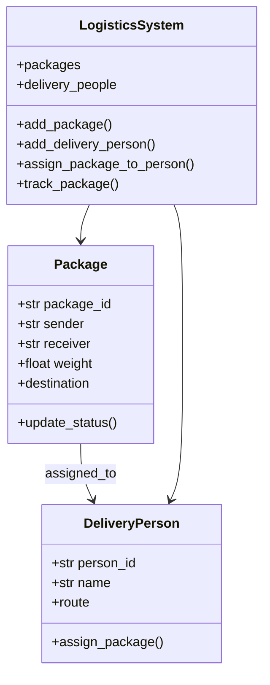

```mermaid
classDiagram
    class Package {
        +str package_id
        +str sender
        +str receiver
        +float weight
        +destination
        +update_status()
    }

    class DeliveryPerson {
        +str person_id
        +str name
        +route
        +assign_package()
    }

    class LogisticsSystem {
        +packages
        +delivery_people
        +add_package()
        +add_delivery_person()
        +assign_package_to_person()
        +track_package()
    }

    Package --> DeliveryPerson : assigned_to
    LogisticsSystem --> Package
    LogisticsSystem --> DeliveryPerson
```
